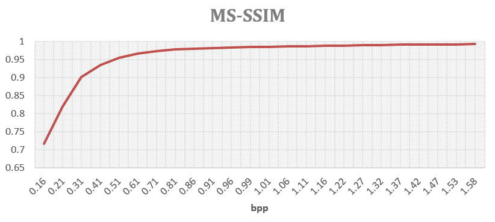

# Convert the images using JPEG under target bpps

  

## Introduction

This program is used to compress the picture from the format `.png` to `.jpg` using algorithm `JPEG` under a certain `bpp`(bit per pixel). 
Notice: the actual `bpp` is a little bigger than the target value. This program is realized based on library `Image` from `PIL`. The actual `bpp` is determined by the compression quality coefficient `q`. However, the type of `q` is `int`, ranging from 1 to 100. And in fact, we let `q` grow slowly from zero on and let it stop converting when its corresponding value of `bpp` is just higher than the target `bpp`.

## Prerequisites

- Python 3 (tested with Python 3.4.5)
- Python packages as specified by requirements.txt (`pip install -r requirements.txt`)
- Linux OS

## How to use 

To do inference, use the following command

    python other_codecs.py inputpath outputpath/'jp' --bpp
    
`Inputpath` is the where you store the images which you want to convert. `Outputpath` is You can convert the images for several certain `bpp`s.
However, in order to adapt to your own images and your target `bpp`, there are some places where you need to change.

- Change your target value of `bpp` in `Line 670`.
- Change the `line 41` to `line 44` if you change your dataset.

Notice: We can still convert images using algorithm `JPEG2000`, `WebP` and `BPG`. However, it needs you to explore it.

## Reference

I make this program mainly under the inspiration from following.

    @inproceedings{mentzer2018conditional1,
        Author = {Mentzer, Fabian and Agustsson, Eirikur and Tschannen, Michael and Timofte, Radu and Van Gool, Luc},
        Booktitle = {Proceedings of the IEEE Conference on Computer Vision and Pattern Recognition (CVPR)},
        Title = {Conditional Probability Models for Deep Image Compression},
        Year = {2018}}

